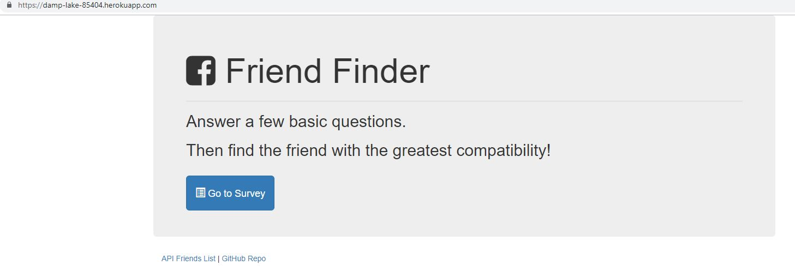
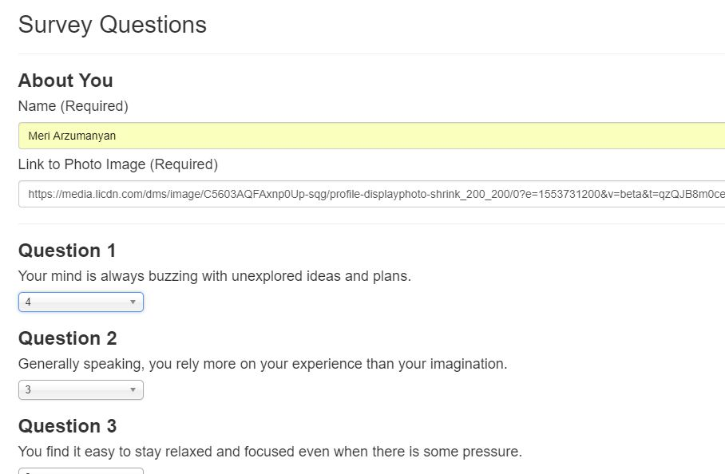
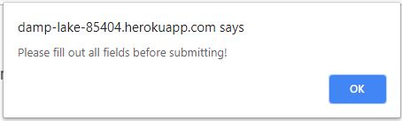
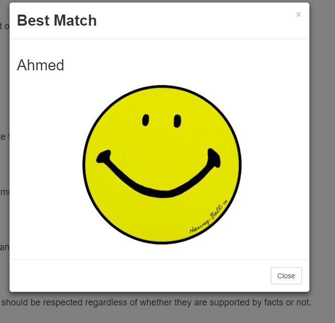
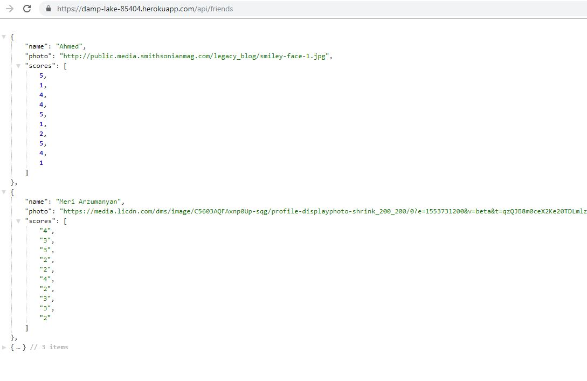

# Friend Finder

## Introduction
This is a web application that collects user specific characteristics and finds best matching friend that have the closest match to provided characteristics.

## Usage
The following link will lead you to the home page hosted in Heroku: https://damp-lake-85404.herokuapp.com/

Home Page will give you three options:

1. `Go to Survey` button
2. Link to `API Friends List`
3. Link to `GitHub Repo`

### Go to Survey
"Go to Survey" button will lead you to the Survey Questions page with a form to fill out. Please fill in your name, insert link of an image of yourself and answer all the questions below. 

Once you are done please submit the form by clicking `Submit` button at the very bottom. A warning message will pop up if you miss to fill out any of the fields.

After successfuly submitting your survey a popup window will appear with the details about the best matching friend that the application was able to find.

### API Friends list
This link will provide you full list of people with their characteristics in JSON format.

### GitHub Repo
This link will lead you to the github location of the source for this application.

### Final Notes
Both links on the Home Page are also availalable on the Survey Page.